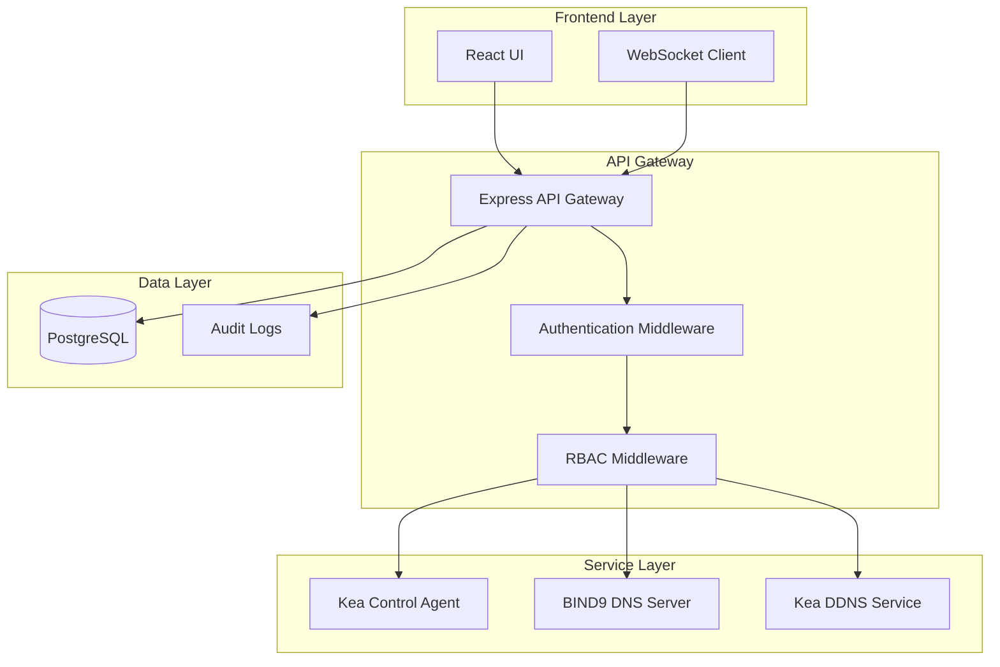

# SagaOS Kea Pilot - Enterprise DHCP & DNS Management Platform

[](https://opensource.org/licenses/MIT)
[](https://www.typescriptlang.org/)
[](https://reactjs.org/)
[](https://nodejs.org/)
[](https://www.postgresql.org/)

A production-ready, enterprise-grade web application for managing Kea DHCP servers, BIND9 DNS, and Dynamic DNS (DDNS) with real-time monitoring and comprehensive network operations capabilities.

## 🚀 Overview

SagaOS Kea Pilot is a modern, TypeScript-first web-based management platform designed for ISP network operations and enterprise network management. It provides a comprehensive interface for Kea DHCP server administration, BIND9 DNS management, and integrated Dynamic DNS services. Built with React 18 and TypeScript, it offers real-time monitoring, advanced configuration management, enterprise-grade security, and production-ready reliability.

**Key Benefits:**
- **Enterprise Ready**: Production-tested with comprehensive security features and audit logging
- **Real-time Operations**: WebSocket-based live monitoring and instant configuration updates
- **Vendor Agnostic**: Works with standard Kea DHCP and BIND9 DNS implementations
- **Scalable Architecture**: Modular design supporting high-availability deployments
- **Commercial Friendly**: MIT licensed for commercial use and customization

## 📋 Table of Contents

- [Features](#-features)
- [Architecture](#-architecture)
- [Quick Start](#-quick-start)
- [Installation](#-installation)
- [Configuration](#-configuration)
- [API Documentation](#-api-documentation)
- [Security](#-security--authentication)
- [Production Deployment](#-production-deployment)
- [Development](#-development--testing)
- [Monitoring](#-monitoring--health-checks)
- [Contributing](#-contributing)
- [Support](#-support--documentation)
- [License](#-license)

## ✨ Features

### 🔧 Advanced DHCP Management
- **Complete Kea DHCP Integration**: Full DHCPv4 and DHCPv6 server management via Kea Control Agent REST API
- **Subnet & Pool Management**: Create, configure, and monitor DHCP subnets and address pools with real-time validation
- **Host Reservations**: Static IP assignments with MAC/DUID binding and custom DHCP options
- **Lease Monitoring**: Real-time lease tracking with advanced search, filtering, and pagination
- **DHCP Options Manager**: Comprehensive option management including vendor-specific options (Option 43, TR-069/CWMP)
- **Client Classification**: Advanced device classification based on Option 60 and custom criteria
- **High Availability**: Monitor and configure Kea HA clusters with automatic failover

### 🌐 Enterprise DNS Management
- **BIND9 Integration**: Complete DNS zone and record management with RFC2136 dynamic updates
- **Dynamic DNS (DDNS)**: Automatic DNS record updates synchronized with DHCP lease events
- **Zone Management**: Create, edit, and delete DNS zones with comprehensive validation and conflict detection
- **Record Management**: Full support for A, AAAA, CNAME, MX, TXT, PTR, and other standard record types
- **TSIG Security**: Secure DNS updates with cryptographic key authentication and authorization
- **Forward/Reverse Zones**: Automated maintenance of both forward and reverse DNS mappings

### 📊 Real-time Monitoring & Analytics
- **Live Health Dashboard**: Real-time monitoring of all services with WebSocket-based updates
- **Service Status Tracking**: Monitor Kea DHCP, BIND9 DNS, DDNS, PostgreSQL, and system components
- **Performance Metrics**: Track DHCP statistics, DNS query rates, lease utilization, and system performance
- **Audit Logging**: Comprehensive activity tracking, change history, and compliance reporting
- **Statistics & Analytics**: Detailed performance metrics, utilization tracking, and capacity planning tools

### 🏗️ Enterprise & Production Features
- **Multi-tenant Architecture**: Support for multiple organizations with data isolation
- **Role-Based Access Control (RBAC)**: Granular permissions and user management
- **Configuration Management**: Backup, restore, versioning, and rollback capabilities
- **API-First Design**: RESTful APIs with comprehensive OpenAPI documentation
- **WebSocket Real-time**: Live updates for all monitoring and operational data
- **Production Security**: CSRF protection, input validation, secure session management

## 🏛️ Architecture

### Technology Stack

**Frontend:**
- **React 18**: Modern React with hooks, concurrent features, and Suspense
- **TypeScript 5.0+**: Strict typing with comprehensive type checking and inference
- **Vite**: Fast build tool with HMR and optimized production builds
- **Tailwind CSS**: Utility-first CSS framework with custom design system
- **shadcn/ui**: High-quality, accessible React components
- **React Router**: Client-side routing with lazy loading and code splitting

**Backend:**
- **Node.js 18+**: Modern JavaScript runtime with ES modules support
- **Express.js**: Fast, minimalist web framework with middleware support
- **PostgreSQL 14+**: Robust relational database with JSON support and connection pooling
- **WebSocket**: Real-time bidirectional communication for live updates
- **Zod**: Runtime type validation and schema parsing

**Infrastructure:**
- **Docker**: Containerized deployment with multi-stage builds
- **Nginx**: Reverse proxy and static file serving
- **PM2**: Process management for production Node.js applications
- **systemd**: Service management and automatic startup

### System Architecture



### Project Structure
```
├── src/                    # Frontend application source
│   ├── components/         # Reusable React components and UI library
│   │   ├── ui/            # shadcn/ui base components
│   │   ├── forms/         # Form components with validation
│   │   └── charts/        # Data visualization components
│   ├── pages/             # Application pages and route components
│   │   ├── dhcp/          # DHCP management pages
│   │   ├── dns/           # DNS management pages
│   │   └── settings/      # Configuration and admin pages
│   ├── lib/               # API clients and utility libraries
│   │   ├── api/           # API client functions and types
│   │   ├── utils/         # Utility functions and helpers
│   │   └── validation/    # Zod schemas and validation logic
│   ├── hooks/             # Custom React hooks
│   │   ├── useWebSocket.ts # WebSocket connection management
│   │   ├── useApi.ts      # API interaction hooks
│   │   └── useAuth.ts     # Authentication state management
│   ├── contexts/          # React context providers
│   │   ├── AuthContext.tsx # Authentication and user state
│   │   └── ErrorContext.tsx # Global error handling
│   └── types/             # TypeScript type definitions
├── backend/               # Backend API gateway and services
│   ├── src/               # Backend source code
│   ├── api-gateway.js     # Main Express application
│   ├── bind9-provider.js  # BIND9 DNS management provider
│   └── rbac-middleware.js # Role-based access control
├── scripts/               # Setup and deployment automation
│   ├── install/           # Installation scripts
│   ├── setup-*.sh        # Service configuration scripts
│   └── utils/             # Utility scripts and helpers
├── docs/                  # Comprehensive documentation
│   ├── api/               # API documentation and contracts
│   ├── security/          # Security guides and best practices
│   └── deployment/        # Production deployment guides
├── infra/                 # Infrastructure as code
│   ├── migrations/        # Database schema migrations
│   ├── seeds/             # Database seed data
│   └── docker/            # Docker configurations
├── config/                # Configuration templates
│   ├── kea/               # Kea DHCP configuration examples
│   ├── bind9/             # BIND9 DNS configuration templates
│   └── nginx/             # Nginx reverse proxy configuration
└── install/               # Installation and setup scripts
    ├── install.sh         # Main installation script
    ├── docker-entrypoint.sh # Docker container entrypoint
    └── validate-installation.sh # Installation validation
```

## 🚀 Quick Start

### ⚡ **One-Command Installation**

**🐧 Linux (Ubuntu/Debian/CentOS/RHEL):**
```bash
curl -fsSL https://raw.githubusercontent.com/BlaineHolmes/saga-kea-pilot/main/install.sh | sudo bash
```

**🐳 Docker:**
```bash
git clone https://github.com/BlaineHolmes/saga-kea-pilot.git
cd saga-kea-pilot && sudo docker-compose up -d
```

### 🌐 **Access Your Installation**

After installation, access the web interface:
- **API Gateway**: http://localhost:3001
- **Health Check**: http://localhost:3001/api/health
- **Kea Control Agent**: http://localhost:8000

**Default Login**: `admin` / `admin` ⚠️ **Change for production!**

> **Note**: The installation script sets up the backend services (Kea DHCP, PostgreSQL, API Gateway). For the web frontend, you can either:
> - Run in development mode: `npm run dev` (serves on port 5173)
> - Build and serve with Nginx: `npm run build` then configure Nginx to serve the `dist/` folder on port 80

### 📋 **Prerequisites**
- **OS**: Ubuntu 20.04+, CentOS 8+, RHEL 8+, Debian 11+
- **RAM**: 4GB minimum, 8GB recommended
- **Storage**: 20GB minimum
- **Network**: Internet connection for installation

#### Option 3: Manual Installation
```bash
# Install dependencies
npm install

# Setup environment
cp .env.local.example .env.local
# Edit .env.local with your configuration

# Setup services
sudo ./scripts/setup-dns-database.sh    # PostgreSQL setup
sudo ./scripts/bind9-setup.sh           # BIND9 configuration
sudo ./scripts/configure-kea-ddns.sh    # Kea DDNS integration

# Start backend and frontend
PORT=3001 node api-gateway-simple.cjs &
npm run dev
```

### First Access
- **Frontend**: http://localhost:5173
- **Backend API**: http://localhost:3001
- **Default Login**: admin / admin (⚠️ Change in production!)

## 🎯 Application Modules

### 1. Dashboard (`/`)
**Real-time System Monitoring and Overview**
- **Service Health Monitoring**: Live status of Kea DHCP, BIND9 DNS, DDNS, PostgreSQL, and system components
- **WebSocket Updates**: Real-time health status updates every 30 seconds with automatic reconnection
- **System Metrics**: Performance indicators, service availability, and resource utilization
- **Quick Actions**: Direct access to critical management functions and emergency controls
- **Alert Management**: Real-time notifications for service issues and system events

### 2. DHCP Manager (`/dhcp`)
**Comprehensive Kea DHCPv4 Server Management**
- **Subnets Tab**: IPv4 subnet configuration, address pools, and network settings with validation
- **Reservations Tab**: Static IP assignments with MAC address binding and custom DHCP options
- **Options Tab**: Advanced DHCP option configuration including vendor-specific options (TR-069, PXE, UniFi)
- **Leases Tab**: Active lease monitoring with real-time updates, search, and filtering
- **Actions Tab**: Bulk operations, configuration management, and server control

### 3. DHCPv6 Manager (`/dhcpv6`)
**IPv6 DHCP Management Capabilities**
- **Subnets6 Tab**: IPv6 network and prefix configuration with delegation support
- **Reservations6 Tab**: IPv6 static assignments with DUID binding and custom options
- **Options6 Tab**: IPv6-specific DHCP options and configurations
- **Leases6 Tab**: IPv6 lease monitoring and management with prefix tracking

### 4. DNS Manager (`/dns`)
**BIND9 DNS Server Administration**
- **Zones Tab**: DNS zone creation, editing, and management with validation and conflict detection
- **Records Tab**: Comprehensive DNS record management (A, AAAA, CNAME, MX, TXT, PTR, etc.)
- **DDNS Integration**: Dynamic DNS configuration and monitoring with automatic synchronization
- **TSIG Security**: Secure DNS update authentication with cryptographic key management

### 5. High Availability Manager (`/ha`)
**Kea HA Cluster Management**
- **HA Status Tab**: Real-time cluster health, synchronization status, and failover monitoring
- **HA Config Tab**: Primary/standby and load-balancing configuration with automatic setup
- **HA Sync Tab**: Lease synchronization, maintenance operations, and conflict resolution

### 6. Statistics Manager (`/statistics`)
**Performance Monitoring and Analytics**
- **Overview Tab**: Comprehensive DHCP and DNS statistics with real-time updates
- **Performance Charts Tab**: Interactive metrics visualization and historical trend analysis
- **Subnet Statistics Tab**: Per-subnet utilization, capacity planning, and growth projections

### 7. Settings (`/settings`)
**System Configuration and Administration**
- **Profile Tab**: User account management and preference configuration
- **Server Config Tab**: Kea and BIND9 server configuration with validation and testing
- **User Management Tab**: User accounts, roles, and access control management
- **Security Tab**: Authentication settings, password policies, and security configuration
- **Backup/Restore Tab**: Configuration backup, restore, and version control
- **Logging Tab**: System logging configuration, audit trails, and log management

## 🔐 Security & Authentication

### Authentication System
- **Default Credentials**: Initial setup with admin/admin (⚠️ **MUST be changed for production**)
- **Database Authentication**: User credentials stored securely in PostgreSQL with SHA256 hashing
- **Session Management**: Secure session handling with CSRF protection and token expiration
- **Role-Based Access Control (RBAC)**: Granular permission management for different user roles
- **Multi-factor Authentication**: Support for TOTP and hardware tokens (enterprise feature)

### Security Features
- **Input Validation**: Comprehensive validation using Zod schemas with sanitization
- **CORS Protection**: Properly configured cross-origin resource sharing with whitelist
- **SQL Injection Prevention**: Parameterized queries and prepared statements throughout
- **XSS Protection**: Input sanitization, output encoding, and Content Security Policy
- **CSRF Protection**: Anti-CSRF tokens for all state-changing operations
- **Audit Logging**: Comprehensive activity tracking, change history, and compliance reporting
- **Secure Headers**: HSTS, X-Frame-Options, X-Content-Type-Options, and other security headers
- **Rate Limiting**: API rate limiting and brute force protection

### Production Security Checklist
⚠️ **CRITICAL**: Before deploying to production:

1. **Change Default Credentials**
   ```bash
   # Generate secure password
   NEW_PASSWORD=$(openssl rand -base64 32)

   # Update database
   PGPASSWORD="$DB_PASSWORD" psql -h localhost -U admin -d kea -c "
   UPDATE users SET password_hash = '$(echo -n "$NEW_PASSWORD" | sha256sum | cut -d' ' -f1)'
   WHERE username = 'admin';"
   ```

2. **Configure Environment Variables**
   ```bash
   # Set secure database password
   DB_PASSWORD=$(openssl rand -base64 32)

   # Configure JWT secret
   JWT_SECRET=$(openssl rand -base64 64)

   # Set production environment
   NODE_ENV=production
   ```

3. **Enable HTTPS**
   - Configure SSL/TLS certificates
   - Enable HSTS headers
   - Redirect HTTP to HTTPS

4. **Network Security**
   - Configure firewall rules
   - Restrict database access
   - Use VPN for remote access

For complete security configuration, refer to the Production Security section above.

## � Installation

### System Requirements
- **Operating System**: Ubuntu 20.04 LTS+ / CentOS 8+ / RHEL 8+ / Debian 11+
- **CPU**: Minimum 2 cores, Recommended 4+ cores
- **Memory**: Minimum 4GB RAM, Recommended 8GB+ RAM
- **Storage**: Minimum 20GB SSD, Recommended 100GB+ SSD
- **Network**: Static IP address with DNS resolution

### Software Dependencies
- **Node.js**: Version 18.x or newer
- **PostgreSQL**: Version 14.x or newer
- **Kea DHCP**: Version 2.4.x or newer with Control Agent
- **BIND9**: Version 9.16.x or newer (optional, for DNS management)
- **Nginx**: Version 1.18.x or newer (for production reverse proxy)

### Installation Methods

#### Method 1: One-Command Installation (Recommended)

**🐧 Linux Native Installation:**
```bash
curl -fsSL https://raw.githubusercontent.com/BlaineHolmes/saga-kea-pilot/main/install.sh | sudo bash
```

**Alternative - Clone and Install:**
```bash
git clone https://github.com/BlaineHolmes/saga-kea-pilot.git
cd saga-kea-pilot
sudo ./install.sh
```

**Installation Options:**
```bash
# Full installation (default)
sudo ./install.sh --type full

# Minimal installation (no BIND9)
sudo ./install.sh --type minimal

# Docker installation
sudo ./install.sh --type docker

# Dry run (preview only)
sudo ./install.sh --dry-run
```

**What gets installed:**
- ✅ Node.js 18+ and npm
- ✅ PostgreSQL 16 database
- ✅ Kea DHCP 2.4+ with Control Agent
- ✅ BIND9 DNS server (optional)
- ✅ Nginx reverse proxy
- ✅ SagaOS web application
- ✅ Systemd services and auto-start

#### Method 2: Docker Installation

**🐳 Quick Docker Setup:**
```bash
git clone https://github.com/BlaineHolmes/saga-kea-pilot.git
cd saga-kea-pilot
cp .env.example .env
sudo docker-compose up -d
```

**🚀 Production Docker Setup:**
```bash
git clone https://github.com/BlaineHolmes/saga-kea-pilot.git
cd saga-kea-pilot
sudo docker-compose -f docker-compose.prod.yml up -d
```

**Docker Management Commands:**
```bash
# View logs
sudo docker-compose logs -f

# Stop services
sudo docker-compose down

# Restart services
sudo docker-compose restart

# Scale API Gateway
sudo docker-compose up -d --scale api-gateway=3
```

**Access Points:**
- 🌐 **Frontend**: http://localhost:5173
- 🔧 **API Gateway**: http://localhost:3001
- 📊 **Health Check**: http://localhost:3001/api/health

#### Method 3: Manual Installation
```bash
# 1. Install Node.js 18.x
curl -fsSL https://deb.nodesource.com/setup_18.x | sudo -E bash -
sudo apt install -y nodejs

# 2. Install PostgreSQL
sudo apt install -y postgresql postgresql-contrib

# 3. Install Kea DHCP
sudo apt install -y kea-dhcp4-server kea-dhcp6-server kea-ctrl-agent kea-dhcp-ddns-server

# 4. Install BIND9 (optional)
sudo apt install -y bind9 bind9utils bind9-doc

# 5. Clone and setup application
git clone <repository-url>
cd sagaos-kea-pilot
npm install

# 6. Configure environment
cp .env.local.example .env.local
# Edit .env.local with your configuration

# 7. Setup services
sudo ./scripts/setup-dns-database.sh    # PostgreSQL setup
sudo ./scripts/bind9-setup.sh           # BIND9 configuration
sudo ./scripts/configure-kea-ddns.sh    # Kea DDNS integration

# 8. Start services
PORT=3001 node backend/api-gateway.js &
npm run dev
```

---

### ⚙️ **Configuration Examples**

#### 📝 **Environment Configuration**

**Create your `.env` file:**
```bash
cp .env.example .env
nano .env
```

**Essential Configuration:**
```bash
# Frontend Configuration
VITE_API_BASE_URL=http://localhost:3001/api
VITE_WS_URL=ws://localhost:3001/ws

# Backend Configuration
PORT=3001
NODE_ENV=development

# Database Configuration
DB_HOST=localhost
DB_PORT=5432
DB_NAME=kea
DB_USER=admin
DB_PASSWORD=admin

# Kea DHCP Configuration
KEA_CA_URL=http://127.0.0.1:8000
KEA_CA_USER=admin
KEA_CA_PASSWORD=admin

# DNS Configuration
DNS_SERVER=127.0.0.1
DNS_PORT=53
DDNS_ENABLED=true
DDNS_FORWARD_ZONE=lan.sagaos.local
DDNS_REVERSE_ZONE=0.10.in-addr.arpa
```

#### 🐳 **Docker Compose Configuration**

**Basic `docker-compose.yml`:**
```yaml
version: '3.8'

services:
  frontend:
    build: .
    ports:
      - "5173:5173"
    environment:
      - VITE_API_BASE_URL=http://localhost:3001/api
      - VITE_WS_URL=ws://localhost:3001/ws
    depends_on:
      - api-gateway

  api-gateway:
    build: ./backend
    ports:
      - "3001:3001"
    environment:
      - DB_HOST=postgres
      - KEA_CA_URL=http://kea-dhcp:8000
      - DNS_SERVER=bind9
    depends_on:
      - postgres
      - kea-dhcp

  postgres:
    image: postgres:16-alpine
    environment:
      - POSTGRES_DB=kea
      - POSTGRES_USER=admin
      - POSTGRES_PASSWORD=admin
    volumes:
      - postgres_data:/var/lib/postgresql/data
      - ./config/database:/docker-entrypoint-initdb.d
    ports:
      - "5432:5432"

  kea-dhcp:
    image: jonasal/kea-dhcp4:2.4.1
    ports:
      - "67:67/udp"
      - "8000:8000"
    volumes:
      - ./config/kea:/etc/kea
    cap_add:
      - NET_ADMIN

  bind9:
    image: internetsystemsconsortium/bind9:9.19
    ports:
      - "53:53/udp"
      - "53:53/tcp"
    volumes:
      - ./config/bind9:/etc/bind
      - bind9_data:/var/lib/bind

volumes:
  postgres_data:
  bind9_data:
```

#### ✅ **Installation Verification**

**Check Service Status:**
```bash
# Check systemd services (native installation)
sudo systemctl status sagaos-api-gateway
sudo systemctl status postgresql
sudo systemctl status kea-dhcp4-server
sudo systemctl status bind9

# Check Docker services
sudo docker-compose ps
sudo docker-compose logs api-gateway
```

**Test API Endpoints:**
```bash
# Health check
curl http://localhost:3001/api/health

# Authentication test
curl -X POST http://localhost:3001/api/auth/login \
  -H "Content-Type: application/json" \
  -d '{"username":"admin","password":"admin"}'

# DHCP configuration
curl http://localhost:3001/api/kea/config

# DNS zones
curl http://localhost:3001/api/dns/zones
```

**Access Web Interface:**
- 🌐 **Frontend**: http://localhost:5173
- 🔧 **API Documentation**: http://localhost:3001/api/health
- 📊 **Login**: admin/admin (⚠️ **Change for production!**)

#### 🔧 **Post-Installation Steps**

1. **Verify Services are Running**:
   ```bash
   # Check all service status
   ./scripts/check-services.sh

   # Or check individual services
   sudo systemctl status sagaos-api
   sudo systemctl status postgresql
   sudo systemctl status isc-kea-dhcp4-server
   ```

2. **Change Default Credentials** (Important!)
3. **Configure Firewall Rules**
4. **Setup SSL/TLS Certificates**
5. **Configure Backup Strategy**
6. **Review Security Settings**

#### 🛠️ **Service Management**

**Check Service Status:**
```bash
# Quick status check
./scripts/check-services.sh

# Individual service status
sudo systemctl status sagaos-api
sudo systemctl status postgresql
sudo systemctl status isc-kea-dhcp4-server
```

**Restart Services:**
```bash
# Restart all services
sudo systemctl restart postgresql sagaos-api isc-kea-dhcp4-server nginx

# Restart individual service
sudo systemctl restart sagaos-api
```

**View Service Logs:**
```bash
# API Gateway logs
sudo journalctl -u sagaos-api -f

# PostgreSQL logs
sudo journalctl -u postgresql -f

# Kea DHCP logs
sudo journalctl -u isc-kea-dhcp4-server -f
```

**Service Auto-Start:**
All services are automatically enabled to start on boot. To disable:
```bash
sudo systemctl disable sagaos-api
```

### Environment Configuration

Create `.env.local` file with your configuration:

```env
# Frontend Configuration
VITE_API_BASE_URL=http://127.0.0.1:3001/api
VITE_WS_URL=ws://127.0.0.1:3001
VITE_USE_MSW=false
VITE_KEA_CA_URL=http://localhost:8000

# Backend Configuration (auto-configured by installer)
NODE_ENV=development
PORT=3001
DB_HOST=localhost
DB_PORT=5432
DB_NAME=kea
DB_USER=admin
DB_PASSWORD=admin  # ⚠️ Change for production

# Service URLs
KEA_CA_URL=http://127.0.0.1:8000
BIND9_HOST=127.0.0.1
BIND9_PORT=53

# Security Configuration
JWT_SECRET=your-jwt-secret-here  # ⚠️ Generate secure secret for production
CSRF_SECRET=your-csrf-secret-here
SESSION_SECRET=your-session-secret-here
```

### Verification

After installation, verify the setup:

```bash
# Check service status
sudo systemctl status kea-dhcp4-server
sudo systemctl status kea-ctrl-agent
sudo systemctl status postgresql
sudo systemctl status bind9  # if DNS enabled

# Test API endpoints
curl http://localhost:3001/api/health
curl http://localhost:3001/api/kea/config

# Access the web interface
# Frontend: http://localhost:5173
# Default login: admin / admin
```

## � API Documentation

### REST API Endpoints

The application provides a comprehensive REST API for all operations:

**Base URL**: `/api/v1`
**Authentication**: JWT Bearer tokens
**Content-Type**: `application/json`

#### Authentication
```bash
# Login
POST /api/auth/login
{
  "email": "admin@example.com",
  "password": "your-password"
}

# Response
{
  "token": "jwt-token-here",
  "user": {
    "id": "user-id",
    "email": "admin@example.com",
    "role": "admin",
    "permissions": { ... }
  }
}
```

#### DHCP Management
```bash
# Get DHCP configuration
GET /api/kea/config

# Get subnets
GET /api/dhcp/subnets

# Create subnet
POST /api/dhcp/subnets
{
  "subnet": "192.168.1.0/24",
  "pools": [{"pool": "192.168.1.100 - 192.168.1.200"}],
  "option-data": [...]
}

# Get leases
GET /api/dhcp/leases?page=1&limit=50

# Get statistics
GET /api/kea/statistics
```

#### DNS Management
```bash
# Get DNS zones
GET /api/dns/zones

# Create zone
POST /api/dns/zones
{
  "name": "example.com",
  "type": "master",
  "records": [...]
}

# Get DNS records
GET /api/dns/zones/{zone}/records

# Create DNS record
POST /api/dns/zones/{zone}/records
{
  "name": "www",
  "type": "A",
  "data": "192.168.1.100",
  "ttl": 3600
}
```

#### WebSocket Events
Real-time updates via WebSocket connection:

```javascript
// Connect to WebSocket
const ws = new WebSocket('ws://localhost:3001');

// Health status updates
{
  "type": "health_update",
  "data": {
    "kea": "healthy",
    "bind9": "healthy",
    "postgres": "healthy"
  }
}

// DHCP lease events
{
  "type": "lease_update",
  "data": {
    "action": "lease_assigned",
    "ip": "192.168.1.150",
    "mac": "aa:bb:cc:dd:ee:ff"
  }
}
```

For complete API documentation, refer to the API Documentation section above.

## 🔧 Configuration

### Kea DHCP Configuration
The application manages Kea through the Control Agent API. Key configuration areas:

**Subnets and Pools**
```json
{
  "subnet4": [
    {
      "subnet": "192.168.1.0/24",
      "pools": [{"pool": "192.168.1.100 - 192.168.1.200"}],
      "option-data": [
        {"name": "routers", "data": "192.168.1.1"},
        {"name": "domain-name-servers", "data": "8.8.8.8, 8.8.4.4"}
      ]
    }
  ]
}
```

**Host Reservations**
```json
{
  "reservations": [
    {
      "hw-address": "aa:bb:cc:dd:ee:ff",
      "ip-address": "192.168.1.50",
      "hostname": "server.example.com",
      "option-data": [
        {"name": "domain-name", "data": "example.com"}
      ]
    }
  ]
}
```

**DHCP Options (including TR-069/CWMP)**
```json
{
  "option-data": [
    {
      "name": "vendor-encapsulated-options",
      "code": 43,
      "data": "01:04:c0:a8:01:01",  // ACS URL in TLV format
      "csv-format": false
    }
  ]
}
```

### BIND9 DNS Configuration
DNS zones and records are managed through RFC2136 dynamic updates:

**Zone Configuration**
```bash
zone "example.com" {
    type master;
    file "/var/lib/bind/db.example.com";
    allow-update { key "ddns-key"; };
};
```

**TSIG Key Setup**
```bash
key "ddns-key" {
    algorithm hmac-sha256;
    secret "base64-encoded-secret-here";
};
```

### Environment Variables
Complete environment configuration options:

```env
# Application
NODE_ENV=production
PORT=3001
LOG_LEVEL=info

# Database
DB_HOST=localhost
DB_PORT=5432
DB_NAME=kea
DB_USER=kea_user
DB_PASSWORD=secure_password
DB_POOL_MIN=2
DB_POOL_MAX=10

# Kea DHCP
KEA_CA_URL=http://localhost:8000
KEA_CA_TIMEOUT=30000

# BIND9 DNS
BIND9_HOST=localhost
BIND9_PORT=53
BIND9_TSIG_KEY=ddns-key
BIND9_TSIG_SECRET=base64-secret

# Security
JWT_SECRET=your-jwt-secret
CSRF_SECRET=your-csrf-secret
SESSION_SECRET=your-session-secret
BCRYPT_ROUNDS=12

# Features
ENABLE_DNS=true
ENABLE_DDNS=true
ENABLE_HA=true
ENABLE_AUDIT_LOG=true
```

## 🧪 Development & Testing

### Development Commands
```bash
# Start development environment
npm run dev                 # Frontend development server with HMR
PORT=3001 node api-gateway-simple.cjs  # Backend API gateway

# Build for production
npm run build              # Create optimized production build
npm run preview            # Preview production build locally

# Code quality and linting
npm run lint               # ESLint code analysis and auto-fix
npm run typecheck          # TypeScript compilation check
npm run format             # Prettier code formatting
npm run lint:fix           # Auto-fix linting issues
```

### Testing Framework
```bash
# Frontend testing
npm run test               # Run unit tests with Vitest
npm run test:coverage      # Run tests with coverage report
npm run test:watch         # Run tests in watch mode
npm run test:ui            # Run tests with UI interface

# Component testing
npm run test:components    # Test React components
npm run test:integration   # Integration tests with MSW

# End-to-end testing
npm run test:e2e           # Playwright E2E tests
npm run test:e2e:ui        # E2E tests with UI

# Backend API testing
curl http://localhost:3001/api/health        # Health check
curl http://localhost:3001/api/kea/config    # Kea configuration
curl http://localhost:3001/api/dns/zones     # DNS zones
```

### Development Workflow
1. **Setup Development Environment**
   ```bash
   git clone <repository-url>
   cd sagaos-kea-pilot
   npm install
   cp .env.local.example .env.local
   ```

2. **Start Services**
   ```bash
   # Start backend services
   sudo systemctl start postgresql
   sudo systemctl start kea-dhcp4-server
   sudo systemctl start kea-ctrl-agent

   # Start development servers
   PORT=3001 node api-gateway-simple.cjs &
   npm run dev
   ```

3. **Make Changes**
   - Frontend changes auto-reload with Vite HMR
   - Backend changes require restart
   - Database schema changes require migrations

4. **Test Changes**
   ```bash
   npm run test              # Unit tests
   npm run test:e2e          # E2E tests
   npm run lint              # Code quality
   npm run typecheck         # Type checking
   ```

### Code Quality Standards
- **TypeScript**: Strict mode with comprehensive type checking
- **ESLint**: Airbnb configuration with React and TypeScript rules
- **Prettier**: Consistent code formatting
- **Husky**: Pre-commit hooks for quality checks
- **Conventional Commits**: Standardized commit message format

## � Production Deployment

### Production Requirements
- **Load Balancer**: Nginx or HAProxy for high availability
- **SSL/TLS**: Valid certificates for HTTPS encryption
- **Monitoring**: Prometheus + Grafana for metrics and alerting
- **Backup**: Automated database and configuration backups
- **Logging**: Centralized logging with ELK stack or similar

### Production Installation
```bash
# 1. Clone repository
git clone <repository-url>
cd sagaos-kea-pilot

# 2. Run production installer
sudo ./install/install-native.sh --production

# 3. Configure SSL/TLS
sudo ./install/setup-ssl.sh --domain your-domain.com

# 4. Setup monitoring
sudo ./install/setup-monitoring.sh

# 5. Configure backups
sudo ./install/setup-backups.sh

# 6. Start production services
sudo systemctl enable --now sagaos-frontend
sudo systemctl enable --now sagaos-backend
sudo systemctl enable --now nginx
```

### Docker Production Deployment
```bash
# Use production Docker Compose
docker-compose -f docker-compose.prod.yml up -d

# Or with custom configuration
docker-compose -f docker-compose.prod.yml \
  --env-file .env.production up -d
```

### Production Configuration
```env
# Production environment
NODE_ENV=production
PORT=3001
LOG_LEVEL=warn

# Database (use strong credentials)
DB_HOST=localhost
DB_PORT=5432
DB_NAME=kea_production
DB_USER=kea_prod_user
DB_PASSWORD=<strong-random-password>
DB_SSL=true
DB_POOL_MAX=20

# Security (generate strong secrets)
JWT_SECRET=<64-char-random-secret>
CSRF_SECRET=<64-char-random-secret>
SESSION_SECRET=<64-char-random-secret>

# SSL/TLS
HTTPS_ENABLED=true
SSL_CERT_PATH=/etc/ssl/certs/sagaos.crt
SSL_KEY_PATH=/etc/ssl/private/sagaos.key

# Monitoring
ENABLE_METRICS=true
METRICS_PORT=9090
HEALTH_CHECK_INTERVAL=30000
```

### High Availability Setup
```bash
# Setup HA PostgreSQL cluster
sudo ./install/setup-postgres-ha.sh

# Configure Kea HA
sudo ./install/setup-kea-ha.sh \
  --primary-ip 192.168.1.10 \
  --secondary-ip 192.168.1.11

# Setup load balancer
sudo ./install/setup-loadbalancer.sh \
  --backend1 192.168.1.10:3001 \
  --backend2 192.168.1.11:3001
```

### Performance Optimization
```bash
# Database optimization
sudo ./install/optimize-postgres.sh

# Nginx optimization
sudo ./install/optimize-nginx.sh

# System optimization
sudo ./install/optimize-system.sh
```

## 📊 Monitoring & Health Checks

### Built-in Health Monitoring
The application includes comprehensive health monitoring:

**Health Check Endpoint**
```bash
curl http://localhost:3001/api/health
```

**Response**
```json
{
  "status": "healthy",
  "timestamp": "2024-01-15T10:30:00Z",
  "services": {
    "kea-dhcp4": {
      "status": "healthy",
      "response_time": 45,
      "last_check": "2024-01-15T10:29:30Z"
    },
    "kea-ctrl-agent": {
      "status": "healthy",
      "response_time": 12,
      "last_check": "2024-01-15T10:29:30Z"
    },
    "bind9": {
      "status": "healthy",
      "response_time": 8,
      "last_check": "2024-01-15T10:29:30Z"
    },
    "postgresql": {
      "status": "healthy",
      "response_time": 3,
      "last_check": "2024-01-15T10:29:30Z"
    }
  },
  "metrics": {
    "active_leases": 1247,
    "total_subnets": 15,
    "dns_zones": 8,
    "uptime": 86400
  }
}
```

### Monitoring Integration
```bash
# Prometheus metrics endpoint
curl http://localhost:3001/metrics

# Grafana dashboard import
sudo ./install/setup-grafana-dashboard.sh

# Alerting rules
sudo ./install/setup-alerting.sh
```

### Log Management
```bash
# Application logs
tail -f /var/log/sagaos/application.log

# Audit logs
tail -f /var/log/sagaos/audit.log

# Error logs
tail -f /var/log/sagaos/error.log

# Access logs
tail -f /var/log/nginx/sagaos-access.log
```

## �📊 Production Deployment

### Docker Deployment
The application includes Docker support for production deployment:

```bash
# Build and run with Docker Compose
docker-compose up -d

# Or build manually
docker build -t sagaos-kea-pilot .
docker run -p 80:80 sagaos-kea-pilot
```

### Manual Production Setup
1. **Build the application**
   ```bash
   npm run build
   ```

2. **Configure web server** (nginx example)
   ```nginx
   server {
       listen 80;
       server_name your-domain.com;

       location / {
           root /path/to/dist;
           try_files $uri $uri/ /index.html;
       }

       location /api {
           proxy_pass http://localhost:3001;
           proxy_http_version 1.1;
           proxy_set_header Upgrade $http_upgrade;
           proxy_set_header Connection 'upgrade';
           proxy_set_header Host $host;
           proxy_cache_bypass $http_upgrade;
       }
   }
   ```

3. **Start backend services**
   ```bash
   # Start API gateway as a service
   PORT=3001 node api-gateway-simple.cjs

   # Or use PM2 for process management
   pm2 start api-gateway-simple.cjs --name "sagaos-api"
   ```

### System Requirements
- **CPU**: 2+ cores recommended
- **RAM**: 4GB+ for production workloads
- **Storage**: 20GB+ for logs and database
- **Network**: Stable connection to managed DHCP/DNS servers

## � Monitoring & Health Checks

### Real-time Monitoring
The application provides comprehensive real-time monitoring through WebSocket connections:

- **Service Health**: Live status monitoring of all integrated services
- **DHCP Statistics**: Lease utilization, packet rates, and error tracking
- **DNS Performance**: Query rates, zone health, and update status
- **Database Connectivity**: Connection pool status and query performance
- **System Metrics**: API response times and resource utilization

### Health Check Endpoints
```bash
# Overall system health
curl http://localhost:3001/api/health

# Individual service checks
curl http://localhost:3001/api/health/postgres
curl http://localhost:3001/api/health/agent
curl http://localhost:3001/api/kea/statistics
curl http://localhost:3001/api/dns/status
```

### WebSocket Real-time Updates
The frontend automatically receives real-time updates via WebSocket:
- **Health Status Changes**: Immediate notification of service status changes
- **DHCP Lease Updates**: Live lease creation, renewal, and expiration events
- **DNS Record Changes**: Real-time DNS update notifications
- **System Alerts**: Critical system events and error notifications

## �️ Configuration Files

### Key Configuration Files
- **`api-gateway-simple.cjs`**: Main backend API gateway with service integrations
- **`bind9-provider.cjs`**: BIND9 DNS management provider with RFC2136 support
- **`dns-schema.sql`**: PostgreSQL database schema for DNS data
- **`users-schema.sql`**: User authentication and authorization schema
- **`vite.config.ts`**: Frontend build configuration with proxy settings
- **`.env.local`**: Environment configuration for development and production

### Kea Configuration Examples
The repository includes sample Kea configurations:
- **`kea-dhcp4-with-ddns.conf`**: DHCPv4 with Dynamic DNS integration
- **`kea-dhcp4-with-hooks.conf`**: DHCPv4 with hook libraries enabled
- **`kea-dhcp4-with-reservation.conf`**: DHCPv4 with host reservations

## 🤝 Contributing

### Development Workflow
1. Fork the repository
2. Create a feature branch (`git checkout -b feature/amazing-feature`)
3. Make changes with appropriate testing
4. Commit using conventional commit format
5. Push to your fork and create a Pull Request

### Code Standards
- **TypeScript**: Strict mode enabled with comprehensive type checking
- **ESLint + Prettier**: Automated code formatting and linting
- **Component Architecture**: Modular, reusable React components
- **API Design**: RESTful endpoints with proper error handling

## 📄 License

### MIT License

Copyright (c) 2024 SagaOS Kea Pilot Contributors

Permission is hereby granted, free of charge, to any person obtaining a copy
of this software and associated documentation files (the "Software"), to deal
in the Software without restriction, including without limitation the rights
to use, copy, modify, merge, publish, distribute, sublicense, and/or sell
copies of the Software, and to permit persons to whom the Software is
furnished to do so, subject to the following conditions:

The above copyright notice and this permission notice shall be included in all
copies or substantial portions of the Software.

THE SOFTWARE IS PROVIDED "AS IS", WITHOUT WARRANTY OF ANY KIND, EXPRESS OR
IMPLIED, INCLUDING BUT NOT LIMITED TO THE WARRANTIES OF MERCHANTABILITY,
FITNESS FOR A PARTICULAR PURPOSE AND NONINFRINGEMENT. IN NO EVENT SHALL THE
AUTHORS OR COPYRIGHT HOLDERS BE LIABLE FOR ANY CLAIM, DAMAGES OR OTHER
LIABILITY, WHETHER IN AN ACTION OF CONTRACT, TORT OR OTHERWISE, ARISING FROM,
OUT OF OR IN CONNECTION WITH THE SOFTWARE OR THE USE OR OTHER DEALINGS IN THE
SOFTWARE.

### Commercial Use

This software is licensed under the MIT License, which permits commercial use, modification, and distribution. You are free to:

- ✅ **Use commercially**: Deploy in commercial environments
- ✅ **Modify**: Customize for your specific needs
- ✅ **Distribute**: Share with others or sell as part of larger solutions
- ✅ **Private use**: Use internally within your organization
- ✅ **Sublicense**: Include in proprietary software

### Third-Party Licenses

This project includes dependencies with their own licenses:
- **React**: MIT License
- **TypeScript**: Apache License 2.0
- **Tailwind CSS**: MIT License
- **Node.js**: MIT License
- **PostgreSQL**: PostgreSQL License (similar to MIT)

### Attribution

While not required by the MIT License, attribution is appreciated:
```
Powered by SagaOS Kea Pilot - Enterprise DHCP & DNS Management Platform
https://github.com/your-org/sagaos-kea-pilot
```

## 🆘 Support & Documentation

### Getting Help
- **GitHub Issues**: Report bugs and request features at [GitHub Issues](https://github.com/your-org/sagaos-kea-pilot/issues)
- **Documentation**: Comprehensive guides available in this README and `/docs` directory
- **Community**: Join our community discussions for help and best practices
- **Commercial Support**: Available for enterprise deployments and custom integrations

### Documentation Resources
All comprehensive documentation is consolidated in this README.md file:
- **Installation Guide**: See the [Installation](#-installation) section for complete setup instructions
- **Security Guide**: See the [Security & Authentication](#-security--authentication) section for best practices
- **API Documentation**: See the [API Documentation](#-api-documentation) section for complete API reference
- **Production Deployment**: See the [Production Deployment](#-production-deployment) section for enterprise setup
- **Configuration Guide**: See the [Configuration](#-configuration) section for detailed configuration options

### Troubleshooting Common Issues

**1. Kea Control Agent Connection Failed**
```bash
# Check if Kea Control Agent is running
sudo systemctl status kea-ctrl-agent

# Verify configuration
sudo kea-shell --host 127.0.0.1 --port 8000

# Test API endpoint
curl http://localhost:8000/
```

**2. Database Connection Issues**
```bash
# Check PostgreSQL status
sudo systemctl status postgresql

# Test database connection
psql -h localhost -U admin -d kea -c "SELECT version();"

# Verify database schema
psql -h localhost -U admin -d kea -c "\dt"
```

**3. BIND9 DNS Issues**
```bash
# Check BIND9 status
sudo systemctl status bind9

# Test DNS resolution
dig @localhost example.com

# Check BIND9 logs
sudo tail -f /var/log/bind/bind.log
```

**4. WebSocket Connection Issues**
```bash
# Check if backend is running
curl http://localhost:3001/api/health

# Verify WebSocket endpoint
wscat -c ws://localhost:3001

# Check browser console for WebSocket errors
```

**5. Frontend Build Issues**
```bash
# Clear node modules and reinstall
rm -rf node_modules package-lock.json
npm install

# Clear Vite cache
rm -rf node_modules/.vite

# Check TypeScript compilation
npm run typecheck
```

### Performance Optimization
- **Database**: Optimize PostgreSQL configuration for your workload size
- **Kea DHCP**: Tune lease database backend and memory settings
- **Frontend**: Enable gzip compression and browser caching
- **Monitoring**: Setup Prometheus and Grafana for comprehensive metrics
- **Load Balancing**: Use Nginx or HAProxy for high-availability deployments

### Default Access Information
- **Frontend URL**: http://localhost:5173 (development) / http://localhost:80 (production)
- **Backend API**: http://localhost:3001
- **Default Login**: admin / admin (⚠️ **MUST be changed for production**)
- **WebSocket**: ws://localhost:3001 (automatic connection from frontend)
- **Health Check**: http://localhost:3001/api/health

---

## 🚀 Quick Links

- **[🏠 Homepage](#sagaos-kea-pilot---enterprise-dhcp--dns-management-platform)**
- **[📦 Installation](#-installation)**
- **[🔐 Security](#-security--authentication)**
- **[📚 API Docs](#-api-documentation)**
- **[🚀 Production](#-production-deployment)**
- **[🤝 Contributing](#-contributing)**
- **[📞 Support](#-support--documentation)**

---

**Built with ❤️ for ISPs and Network Operators**

*SagaOS Kea Pilot - Making DHCP and DNS management simple, secure, and scalable.*

**Production-ready DHCP & DNS management for modern networks** 🚀
